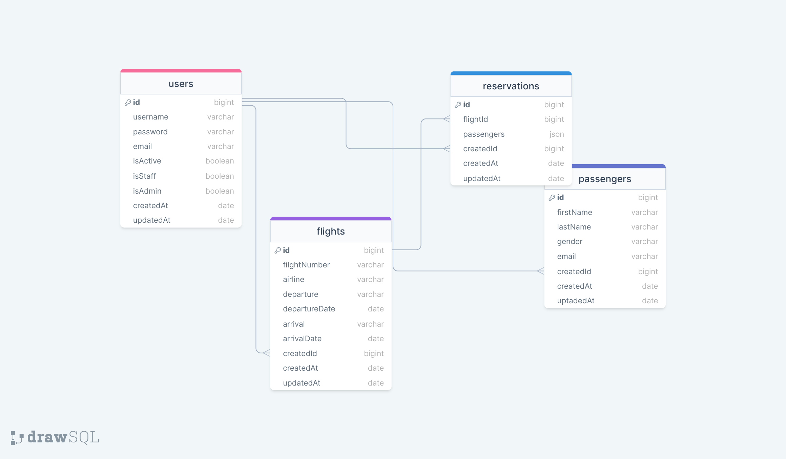

# FLIGHT RESERVATION API

### ERD:



### Installation:

```sh
    $ mkdir logs
    $ cp .env-sample .env
    $ npm i
```

### Folder/File Structure:

```
    .env
    .gitignore
    index.js
    package.json
    readme.md
    logs/
    src/
        configs/
            dbConnection.js
        controllers/
            auth.js
            flight.js
            passenger.js
            reservation.js
            user.js
        helpers/
            passwordEncrypt.js
            setToken.js
            sync.js
        middlewares/
            authentication.js
            errorHandler.js
            findSearchSortPage.js
            logger.js
            permissions.js
        models/
            flight.js
            passenger.js
            reservation.js
            user.js
        routes/
            auth.js
            flight.js
            passenger.js
            reservation.js
            user.js
```

- admin aşağıdakilerin hepsini gerçekleştirebilir
- herhangi bir kullanıcı siteme kayıt olabilir
- admin user staff / admin oluşturuabilir veya bir user ı staff / admin olarak değiştirebilir
- staff user bir veya birden fazla flight oluşturabilir
- user birden fazla rezervasyon yapabilir
- user birden fazla passenger oluşturabilir
- bir flight ta birden fazla rezervasyon olabilir
-
- her user kendi rezervasyonunu görebilir / değiştirebilir
- uçuşlar listelenirken gelecekteki uçuşlar listelensin
- bir uçuştaki yolcular listelenebilsin
- her bir yolcunun yaptığı uçuşlar listelenebilsin
- zamanı gelmiş veya geçmiş rezervasyonlarda değişiklik yapılamasın
-
- proje yapılan seçime göre simple token veya jwt ile token konrolü yapsın
